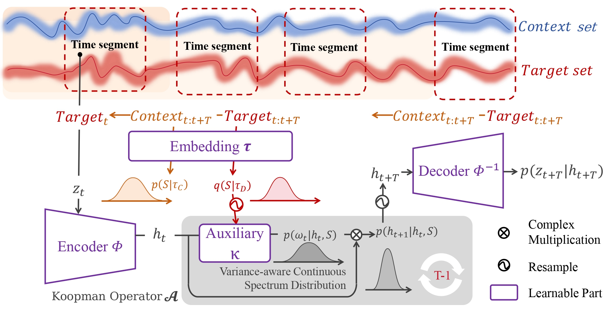
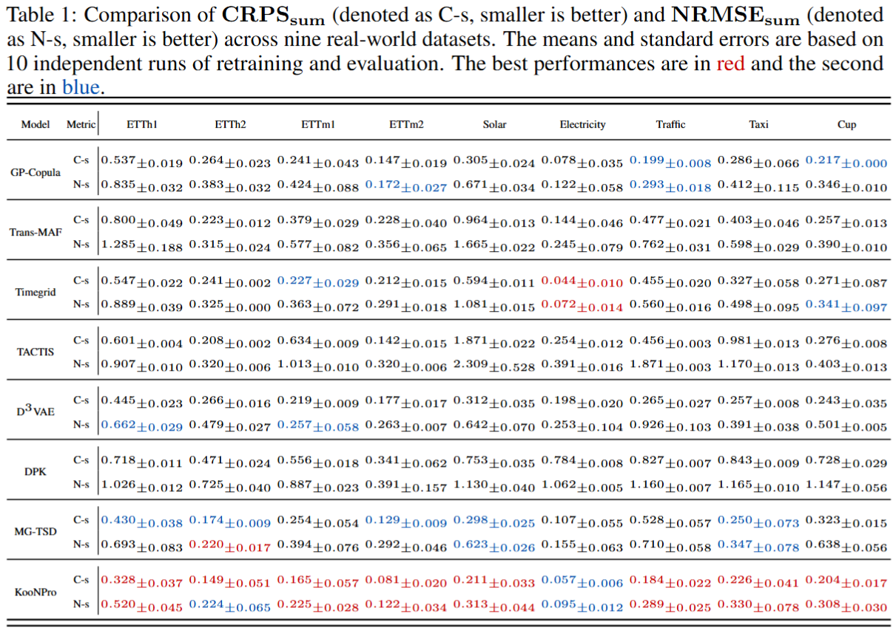
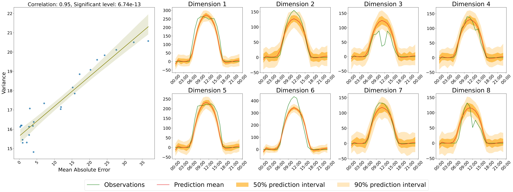

# KooNPro 
 KOONPRO: AVARIANCE-AWARE KOOPMAN PROBABILISTIC MODEL ENHANCED BY NEURAL PROCESSES FOR TIME SERIES FORECASTING

The probabilistic forecasting of time series is a well-recognized challenge, particularly in disentangling correlations among interacting time series and addressing the complexities of distribution modeling. By treating time series as temporal dynamics, we introduce KooNPro, a novel probabilistic time series forecasting model that combines variance-aware deep Koopman model with Neural Process. KooNPro introduces a variance-aware continuous spectrum using Gaussian distributions to capture complex temporal dynamics with improved stability.  It further integrates the Neural Process to capture fine dynamics, enabling enhanced dynamics capture and prediction. Extensive experiments on nine real-world datasets demonstrate that KooNPro consistently outperforms state-of-the-art baselines. Ablation studies highlight the importance of the Neural Process component and explore the impact of key hyperparameters. Overall, KooNPro presents a promising novel approach for probabilistic time series forecasting.

## Main Idea

The detailed overview of KooNPro, with the complete architecture illustrated in Figure 1. The central idea of KooNPro is to learn temporal dynamics for probabilistic future prediction by integrating Neural Process (NP) with the probabilistic deep Koopman model. Initially, NP captures the dot spectrum of dynamics governing the entire time series which is shown by the downward arrows in Figure 1. Additionally, inspired by the concept of pseudospectra, we utilize the probabilistic deep Koopman model to refine these dynamics,
obtaining a variance-aware continuous spectrum for prediction which is demonstrated by the shadowed box in Figure 1.

<p align="center">  
  
<br/>
Figure1
</p>  


## Result

Table 1 presents the CRPS~sum~ and $\bf{NRMSE}_{sum}$ values, averaged over 10 independent runs. In comparison, traditional baseline models (e.g., GP-Copula and Timegrid) have higher $\bf{CRPS}_{sum}$ values on most datasets, which indicates their difficulty in handling complex time series data. Compared to modern deep generative models (e.g., D$^{3}$VAE and TACTIS), KooNPro achieves a better balance between predictive stability and accuracy. Although MG-TSD shows a slight advantage in $\bf{NRMSE}_{sum}$ on certain datasets , its $\bf{CRPS}_{sum}$ fluctuates significantly, suggesting an inadequate characterization of distributional uncertainty. KooNPro introduces variance-aware spectrum to enhance global pattern capturing, avoiding spectrum instability caused by local perturbations, thus achieving higher stability and accuracy in handling complex nonlinear patterns. This demonstrates its effectiveness in high-dimensional time series forecasting.

<p align="center">  
  
<br/>
Table 1
</p>  

Figure 2 visualizes the predictive result on the solar dataset. The right panel gives a scatter plot of MAE versus prediction variance showing a correlation of $0.94$ with a significance level near zero, confirming that KooNPro effectively captures temporal dynamics and ensures reliable predictions. The left panel visualizes the ground truth and predictions for the first eight plants over 24 hours. The results demonstrate that KooNPro accurately captures the temporal fluctuations in Solar energy generation: the predicted mean closes to zero during nighttime and rises to varying peaks during daylight hours for each plant. Furthermore, the prediction intervals widen during sunlight and night periods, corresponding to the peak and trough of Solar fluctuations, reflecting the reliability of the predictions.

<p align="center">  
  
<br/>
Figure2
</p>  

## Quick start
According to ablation study, we record the best setting of nine datasets and save as **.json** files. For example, we give a quick start for the solar dataset.
```
CONFIG_FILE="/setting/solar_args.json" 
$PYTHON_CMD run.py --config $CONFIG_FILE
```

## Citation


